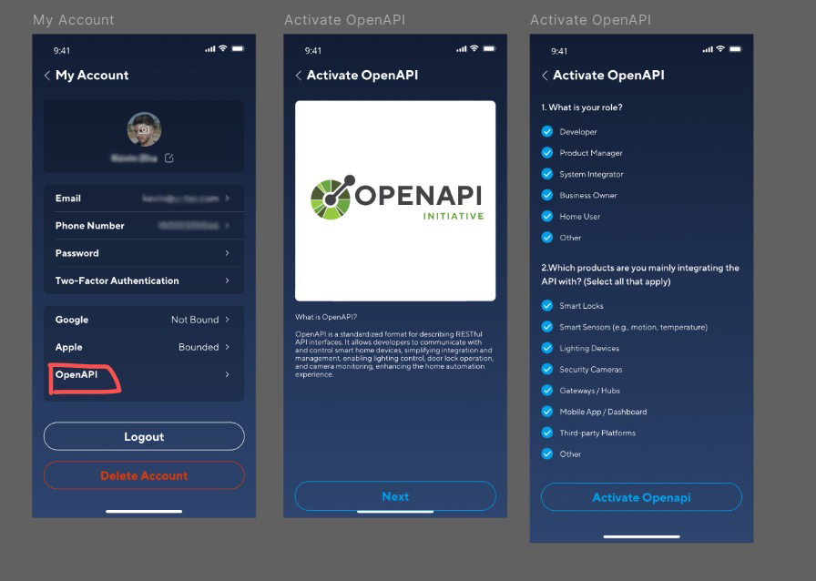
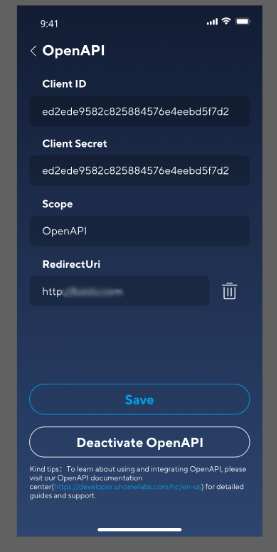

# Uhome (U-Tec)

Home Assistant control for U-Tec locks, lights, switches, and sensors through the Uhome API.

| | |
| --- | --- |
| Devices | Locks, lights, switches, Wi-Fi smart plugs |
| Talks to | U-Tec cloud API, plus an optional webhook or Nabu Casa cloudhook |
| Install | [HACS](#install) custom integration |
| Credentials | Xthings Home app, My Account → OpenAPI |

## What you get

- Lock, unlock, and passage-mode state
- Door state, when the lock has a door sensor
- Battery level and battery status
- On and off for switches, plugs, and bulbs that expose the switch capability
- SwitchLevel for dimming until U-Tec ships a real light capability
- Adaptive Aggressive confirmation for locks when a push never arrives

The U-Tec API does not currently expose Wi-Fi bridge modules or Air Portal devices.

## Adaptive Aggressive

U-Tec can register a webhook or a Nabu Casa cloudhook. Those pushes often never arrive, so Home Assistant otherwise learns a lock or unlock only on the next idle poll.

Adaptive Aggressive is off until you turn it on. After a lock or unlock from Home Assistant it polls only that lock:

1. The command is sent as usual.
2. A confirmation burst polls on the `ADAPTIVE_AGGRESSIVE_DELAYS` schedule: 1s, 1s, 1s, 1s, 2s, 3s, 5s, 8s, 13s (at most 9 polls, about 35 seconds).
3. The burst stops when the API reports the commanded state, a push carrying `st.lock` matches it, the schedule runs out, the next delay would be at least the idle poll interval, or polls keep failing (two errors in a row, or the regular poll failure threshold).
4. Lights, switches, and every other device stay on the idle interval. Passage mode is skipped, because the lock ignores the command.

A confirmed burst is remembered for one idle interval, capped at `CONFIRMATION_WINDOW_CAP` (60 seconds). A later poll or push that contradicts that confirmation is not applied. The burst is re-armed and the fresh poll wins. A new lock or unlock clears the confirmation, so the new command is not treated as a contradiction. A battery or door push cannot confirm a burst.

If the burst gives up, the integration logs a warning and fires `u_tec_lock_command_failed` with `device_id`, `expected_locked`, `attempts`, and `reason`. Burst polls use their own signal, so optimistic lock updates keep their grace period instead of flickering on the first poll.

Debug progress is under `custom_components.u_tec`.

### Recommended lock settings

- Polling interval: 20 seconds. Kind to the API, and still long enough for the full confirmation sequence.
- Optimistic updates for locks: off. Show what the API confirmed.
- Adaptive Aggressive: on, for every lock or only the ones you operate from Home Assistant.

Configure → Adaptive Aggressive, after the integration is set up.

## Polling interval and Debug Polling Mode

Every install of this integration talks to the same U-Tec cloud API, and U-Tec publishes no rate limits for it. The polling interval is therefore 10 to 3600 seconds, with 10 as the default. One poll is one bulk request per install, so 10 seconds is about 8,600 requests a day, and 1 second would be about 86,400. Please use the longest interval that works for you. For quick lock feedback, Adaptive Aggressive polls briefly after a command instead of all day.

An interval below 10 seconds saved under 0.6.1 is raised to 10 when the integration loads, with a warning in the log. A `scan_interval` below 10 in `configuration.yaml` is treated as 10.

For testing, Debug Polling Mode gives you 1-second polling for a short window:

- Start it with the **Start debug polling** button on the U-Tec Integration device, or the `u_tec.start_debug_polling` action. Stop it early with **Stop debug polling** or `u_tec.stop_debug_polling`.
- It polls every second for 2 minutes, about 120 requests, then goes back to your configured interval on its own. Pressing start again while it runs does not extend it.
- While it runs, Adaptive Aggressive, push state, and optimistic updates are paused, so what you see is raw polled state. Pushes still update the Last Push sensor.
- It ends early if polls fail enough to mark entities unavailable.
- It is never saved. A restart or reload always comes back at your configured interval.
- Start, stop, the reason, and the request count are logged at WARNING. The **Debug polling** diagnostic binary sensor shows whether a session is running, when it ends, and how many requests it made.

## Install

### HACS

1. In HACS, add this repository as an integration.
2. Search for U-Tec and install it.
3. Restart Home Assistant.

### Manual

Copy `custom_components/u_tec` into your Home Assistant `custom_components` directory and restart.

## Credentials

You need API credentials before setup. They come from the Xthings Home app (formerly U-Home), version 3.5.5 or later. No developer-portal request.

1. Open the Xthings Home app and go to My Account.
2. Tap OpenAPI.
3. Activate OpenAPI, choose your role and products, then tap Activate Openapi.

Set `RedirectUri` to `https://my.home-assistant.io/redirect/oauth` exactly. Do not replace the hostname. Confirm `Scope` is `OpenAPI`, then save.

The integration needs the Client ID and Client Secret. Details are in the [Developer API documentation](https://doc.api.u-tec.com/#intro). API problems go to [Xthings support](https://developer.xthings.com/hc/en-us/requests/new). See [issue #36](https://github.com/LF2b2w/Uhome-HA/issues/36) for the credential flow. Screenshots courtesy of @geofox784.

Home Assistant must know its own URL before the next step. Settings → System → Network, and set the Home Assistant URL. A local install is usually `http://homeassistant.local:8123`. Push delivery also needs external access, normally Nabu Casa.

## Configure

1. Settings → Devices & services → Integrations.
2. Add integration, search for U-Tec, and enter the Client ID and Client Secret.
3. Sign in on the U-Tec [OAuth page](https://oauth.u-tec.com/login/auth) and authorize the connection.
4. Link the account when Home Assistant asks.

Rotate credentials from the integration's Reconfigure action. You do not need to remove the integration. Polling interval, optimistic updates, and Adaptive Aggressive are on Configure after setup.

## Help

Questions and setup notes live in the [FAQ discussion](https://github.com/LF2b2w/Uhome-HA/discussions/2). Bugs go on [Issues](https://github.com/LF2b2w/Uhome-HA/issues). Pull requests are welcome.

MIT licensed. See [LICENSE](./LICENSE).

Made by @LF2b2w.
